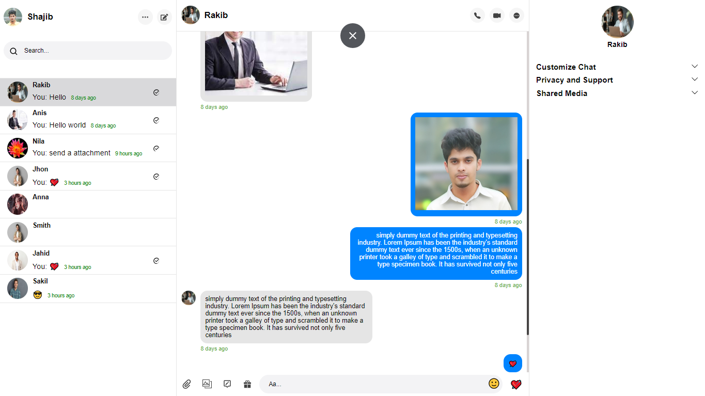

### Chat Application using MERN Stack

#### Project Image:

#### Features:

- User authentication (login, register, logout)
- Dark mode support
- Responsive design
- One-on-one messaging with friends
- Seen, Unseen, and Active features
- Text, file, and emoji sharing
- New message notification with sound

#### Technologies Used:

- Node.js
- Express.js
- MongoDB
- React.js
- Cloudinary (for file storage)
- Sass (for styling)
- Redux Toolkit (for state management)
- Socket.IO (for real-time communication)

#### GitHub Repository:

[GitHub Link](https://github.com/developer-shajib/Chat-App-with-MERN-Stack.git)

#### Live Demo:

[Live Demo Link](https://chat-app-with-mern-stack.vercel.app)

#### Video Demo:

[Video Demo Link](https://www.linkedin.com/posts/developer-shajib_uses-features-activity-7129863979413229570-SORK?utm_source=share&utm_medium=member_desktop)

---
